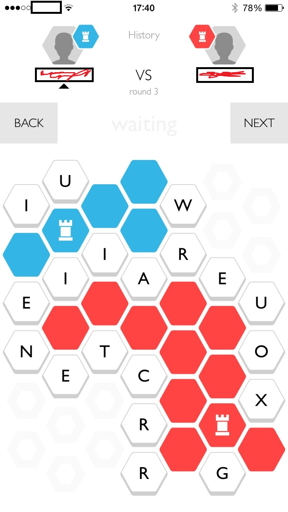

# capitals-solver
Process screenshots &amp; suggest moves for the iPhone game 'Capitals'

## Usage

    ./game.py example.png red

## Dependencies

- Ubuntu
  - python
  - tesseract-ocr
  - python-opencv
  - python-matplotlib (optional)
  - [pytesseract](https://pypi.python.org/pypi/pytesseract/0.1)
    - install python-pip
    - `pip install pytesseract`

## Example

## TODO

- fix RGB/BGR
- strategy:
  - ensure self capital protected
  - don't bridge gap
- output presentation
  - clean list, and/or:
  - image w/ highlighted tiles
