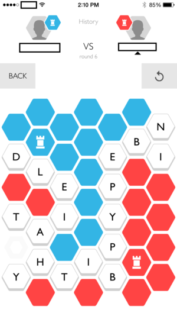
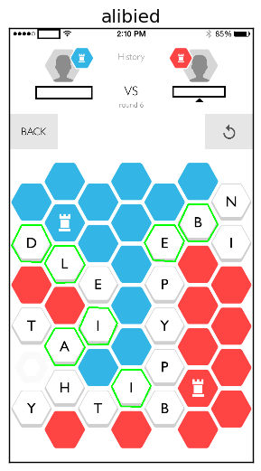
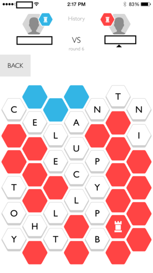
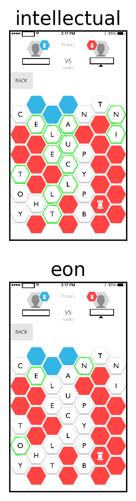

# capitals-solver
Process screenshots &amp; suggest moves for the iPhone game ['Capitals'](https://itunes.apple.com/us/app/capitals-free-word-battle/id968456900)

## Usage

    ./game.py example.png red

## Dependencies

- Ubuntu
  - python
  - tesseract-ocr
  - python-opencv
  - python-matplotlib (optional)
  - [pytesseract](https://pypi.python.org/pypi/pytesseract/0.1)
    - install python-pip
    - `pip install pytesseract`

## Examples

### Basic word suggestion

    # Find suggestions for blue player. Suggestions are sorted by possible
    # territory gain, and secondarily by enemy player territory loss, and
    # the top ten (typically of thousands) are shown. May not lead to best
    # strategy. Words are not unique, ie there is more than one way to
    # spell 'courier'
    $ ./game.py example/example.png blue
    word:         airier, territory gain    5, enemy territory loss    5
    word:        courier, territory gain    5, enemy territory loss    5
    word:        rainier, territory gain    5, enemy territory loss    5
    word:        courier, territory gain    5, enemy territory loss    4
    word:         carrie, territory gain    4, enemy territory loss    5
    word:          aerie, territory gain    4, enemy territory loss    5
    word:         racine, territory gain    4, enemy territory loss    5
    word:       anorexic, territory gain    4, enemy territory loss    5
    word:          erica, territory gain    4, enemy territory loss    5

### Vulnerable enemy capital

    # Taking the enemy capital grants an extra turn, and it is usually possible
    # to win on the extra turn. If the enemy capital is vulnerable, the code
    # suggests the word which takes the capital along with the maximum number
    # of other enemy tiles
    $ ./game.py example/ss.png red
    Possible to gain extra turn: suggestions.png

### Extra turn / finishing move

    # This is the result of making the above suggested move. It is trivially
    # easy to finish off blue using the extra turn. My code recognizes that
    # the game is winnable and suggests the longest and shortest winning moves
    $ ./game.py example/ss2.png red
    Game is winnable this turn: suggestions.png
    

